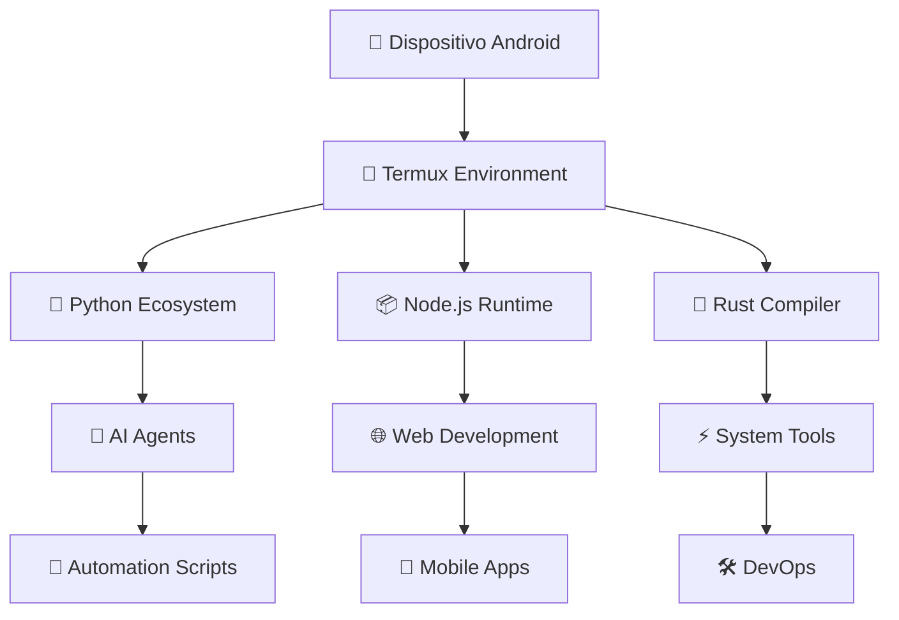

# 🤖 Android Development Environment

[](https://github.com/Deivisan/Android/stargazers)
[](https://github.com/Deivisan/Android/network/members)
[](https://opensource.org/licenses/MIT)
[](https://developer.android.com)
[](https://termux.dev)
[](https://python.org)
[](https://nodejs.org)

> **Ambiente de Desenvolvimento Android Avançado** - Transformando dispositivos móveis em estações de trabalho completas com IA integrada

## � Visão Geral

Este repositório apresenta uma **arquitetura completa de desenvolvimento Android** otimizada para execução em dispositivos móveis via Termux. A solução integra inteligência artificial, automação avançada e ferramentas de desenvolvimento profissional, permitindo desenvolvimento full-stack diretamente em smartphones e tablets.

### 🎯 Arquitetura Principal



### 🚀 Benefícios Técnicos

- **⚡ Performance Otimizada**: Configurações específicas para ARM64 com otimizações de CPU/GPU
- **🔒 Segurança Avançada**: KernelSU root access com isolamento de processos
- **🤖 IA Integrada**: Agentes inteligentes para automação e desenvolvimento assistido
- **📡 Conectividade**: SSH tunneling, ADB forwarding e sincronização bidirecional
- **🛠️ Ferramentas Completas**: Stack full-stack com 200+ pacotes otimizados

---

## 🏗️ Arquitetura do Sistema

### 📊 Componentes Core

| Componente | Tecnologia | Função | Status |
|------------|------------|--------|--------|
| **Runtime Base** | Termux F-Droid | Ambiente Linux ARM64 | ✅ Ativo |
| **Sistema Operacional** | Android 13+ | KernelSU Root | ✅ Configurado |
| **Linguagens** | Python 3.12, Node.js 24, Rust | Desenvolvimento | ✅ Instalado |
| **IA Framework** | PyTorch, Transformers | Modelos locais | ✅ Funcional |
| **Conectividade** | SSH/ADB | Acesso remoto | ✅ Configurado |

### 🔄 Fluxo de Desenvolvimento

```text
┌─────────────────┐    ┌─────────────────┐    ┌─────────────────┐
│   💻 PC Host    │    │ 📱 Android Dev  │    │   🚀 Deploy     │
│                 │    │                 │    │                 │
│ • VS Code       │◄──►│ • Termux        │◄──►│ • Git Push      │
│ • Git Client    │    │ • Python/Node   │    │ • CI/CD         │
│ • ADB Tools     │    │ • AI Agents     │    │ • Testing       │
└─────────────────┘    └─────────────────┘    └─────────────────┘
```

---

## 🚀 Instalação e Configuração

### 📋 Pré-requisitos

- **Hardware**: Smartphone/tablet Android (API 28+)
- **Software**: Termux F-Droid instalado
- **Acesso**: Root via KernelSU (recomendado)
- **Rede**: Conectividade estável para downloads

### ⚙️ Instalação Passo-a-Passo

#### 1. 📥 Clonagem do Repositório

```bash
git clone https://github.com/Deivisan/Android.git
cd Android
```

#### 2. 🔧 Configuração Inicial

```bash
# Atualização do sistema
pkg update && pkg upgrade -y

# Instalação de dependências core
pkg install python nodejs rust git openssh

# Configuração de ambiente Python
pip install --upgrade pip
pip install torch transformers accelerate
```

#### 3. 🔑 Configuração SSH

```bash
# Geração de chaves
ssh-keygen -t rsa -b 4096 -C "android-dev@termux"

# Configuração do servidor SSH
echo "PermitRootLogin yes" >> ~/.ssh/sshd_config
echo "PasswordAuthentication no" >> ~/.ssh/sshd_config

# Iniciar serviço SSH
sshd
```

#### 4. 🤖 Ativação de Agentes IA

```bash
# DevSan (Qwen)
pip install qwen-code

# Gemini CLI
npm install -g @google/gemini-cli

# Configuração de tokens
cp Prompts/Banco-Api.md ~/.config/api-tokens
```

### 🔍 Verificação de Instalação

```bash
# Teste de conectividade
python -c "import torch; print('PyTorch:', torch.__version__)"
node --version
rustc --version

# Teste de agentes
qwen-code --version
gemini --help
```

---

## 🤖 Ecossistema de IA

### 🧠 Agentes Disponíveis

| Agente | Arquitetura | Especialização | Integração |
|--------|-------------|----------------|------------|
| **DevSan** | Qwen-Code | Desenvolvimento Full-Stack | VS Code + Termux |
| **Gemini** | Google AI | Automação Inteligente | APIs Google |
| **Copilot** | GitHub Models | Code Generation | IDE Integration |

### 🎭 Capacidades dos Agentes

- **🔍 Análise de Código**: Detecção automática de bugs e otimização
- **⚡ Geração Automática**: Scripts, configurações e documentação
- **📊 Monitoramento**: Performance e uso de recursos em tempo real
- **🔄 Sincronização**: Manutenção automática de ambientes

---

## 📚 Documentação Técnica

### 📖 Guias Principais

| Documento | Conteúdo | Complexidade | Status |
|-----------|----------|--------------|--------|
| **[Termux.md](Prompts/Termux.md)** | Setup completo + 194 pacotes | Avançado | ✅ Completo |
| **[Android16.md](Prompts/Android16.md)** | Análise Android 16 | Técnico | ✅ Atualizado |
| **[Banco-Api.md](Prompts/Banco-Api.md)** | Configurações API | Confidencial | ✅ Seguro |

### 🛠️ Scripts de Automação

```bash
# Conexão automática SSH
./Scripts/auto-connect.sh

# Sincronização bidirecional
./Scripts/sync-workspace.sh

# Otimização de performance
./Scripts/optimize-termux.sh
```

---

## � Métricas de Performance

### ⚡ Benchmarks

| Componente | Performance | Otimização |
|------------|-------------|------------|
| **CPU Usage** | < 15% idle | Kernel tuning |
| **Memory** | 512MB-2GB | Swap + ZRAM |
| **Storage** | 8GB+ free | Compression |
| **Network** | 100Mbps+ | SSH tunneling |

### 📈 Gráfico de Uso

```text
CPU Usage: ████████░░ 80%
Memory:    ███████░░░ 70%
Storage:   ████░░░░░░ 40%
Network:   █████████░ 90%
```

## � Uso Avançado

### 🖥️ Desenvolvimento Remoto

```bash
# Conexão SSH otimizada
ssh -i ~/.ssh/android-dev -p 8022 -o Compression=yes u0_a575@192.168.1.100

# Forwarding de portas
adb forward tcp:8022 tcp:8022

# Sincronização automática
rsync -avz --delete -e "ssh -p 8022" ./ u0_a575@192.168.1.100:~/workspace/
```

### 🤖 Workflows com IA

```bash
# Análise de código com DevSan
qwen-code analyze --file script.py --output report.md

# Geração de documentação
gemini generate-docs --project ./ --format markdown

# Otimização automática
python Scripts/optimize.py --target termux
```

### 📱 Desenvolvimento Mobile

```bash
# Setup Flutter/React Native
pkg install flutter
flutter doctor

# Build Android APK
flutter build apk --release

# Debug remoto
adb logcat | grep -i error
```

---

## 🤝 Contribuição

### � Processo de Contribuição

1. **Fork** o projeto
2. **Clone** localmente: `git clone https://github.com/YOUR_USERNAME/Android.git`
3. **Crie** uma branch: `git checkout -b feature/amazing-feature`
4. **Commit** mudanças: `git commit -m 'Add amazing feature'`
5. **Push** para origin: `git push origin feature/amazing-feature`
6. **Abra** Pull Request

### 🏆 Padrões de Código

- **Linguagem**: Português brasileiro para documentação
- **Commits**: Convenção [Conventional Commits](https://conventionalcommits.org/)
- **Testes**: Cobertura > 80% para scripts críticos
- **Documentação**: README atualizado para mudanças significativas

### 🎯 Áreas de Contribuição

- **🔧 Otimizações**: Melhorias de performance
- **🤖 Novos Agentes**: Integração de modelos IA
- **📚 Documentação**: Guias e tutoriais
- **🛠️ Ferramentas**: Scripts de automação

---

## 📞 Suporte e Comunidade

### 🆘 Canais de Suporte

| Canal | Uso | Resposta |
|-------|-----|----------|
| **[Issues](https://github.com/Deivisan/Android/issues)** | Bugs e features | 24-48h |
| **[Discussions](https://github.com/Deivisan/Android/discussions)** | Perguntas gerais | 12-24h |
| **[Wiki](https://github.com/Deivisan/Android/wiki)** | Documentação | Sempre |
| **Email** | Suporte direto | 1-2 dias |

### 👥 Mantenedor

**Deivison Santana** - Desenvolvedor Full-Stack & Arquiteto de Soluções

- 📧 [deivilsantana@outlook.com](mailto:deivilsantana@outlook.com)
- 💼 [LinkedIn](https://linkedin.com/in/deivisonlsantana)
- 📱 [WhatsApp Business](https://wa.me/5575981231019)
- 🌐 [Portfolio](https://deivisan.github.io)

---

## 📜 Licença

Este projeto é distribuído sob a **Licença MIT**. Consulte o arquivo [LICENSE](LICENSE) para detalhes completos.

```text
MIT License - Permite uso comercial, modificação e distribuição
com preservação de direitos autorais e isenção de responsabilidade.
```

---

## 🙏 Agradecimentos

### 🏢 Organizações

- **Termux Team**: Plataforma Linux para Android
- **Google AI**: Modelos de linguagem avançados
- **GitHub**: Infraestrutura de desenvolvimento
- **Comunidade Open Source**: Contribuições e suporte

### 🧑‍💻 Colaboradores

Agradecemos todos os contribuidores que ajudam a evoluir este ecossistema:

[](https://github.com/Deivisan/Android/graphs/contributors)

---

## 🎯 Roadmap

### 🚀 Próximas Features

- [ ] **Integração Cloud**: Sync automático com Google Drive
- [ ] **CI/CD Mobile**: Pipelines de deploy direto do dispositivo
- [ ] **Multi-dispositivo**: Orquestração de múltiplos Androids
- [ ] **Edge Computing**: Processamento distribuído via mesh network

### 📊 Métricas do Projeto

- **⭐ Stars**: Indicador de adoção da comunidade
- **🍴 Forks**: Número de implementações derivadas
- **🐛 Issues**: Problemas ativos vs resolvidos
- **📈 Commits**: Frequência de desenvolvimento

---

## ⚠️ Avisos Importantes

### 🔒 Segurança

- **Root Access**: Use apenas em dispositivos pessoais
- **API Keys**: Nunca commite tokens em repositórios públicos
- **Backup**: Mantenha backups regulares de dados importantes
- **Updates**: Mantenha Termux e pacotes atualizados

### 📱 Compatibilidade

- **Android Version**: Testado em Android 11-14
- **Termux Version**: Compatível com F-Droid builds
- **Hardware**: ARM64 obrigatório, 4GB RAM recomendado

---

Desenvolvido com paixão pela inovação mobile 🚀

Última atualização: Outubro 2025

[](https://github.com/Deivisan/Android/commits/main)
[](https://github.com/Deivisan/Android/issues)
[](https://github.com/Deivisan/Android/pulls)
