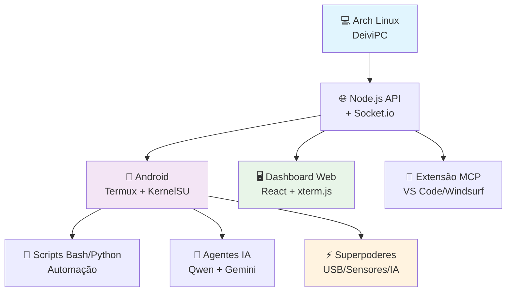

# 🚀 Transcrição Grok - Meu Android é Agente 007

[](https://github.com/deivisan/Android/stargazers)
[](https://github.com/deivisan/Android/network/members)
[](https://opensource.org/licenses/MIT)

> **Fonte**: Conversa com Grok (21/11/2025)  
> **Link**: https://grok.com/share/c2hhcmQtMg_56527f93-9d16-43b7-9a88-52df4b45e012  
> **Captado por**: DevSan (Metodologia Scrappy v3.0)

---

## 📋 Índice (TOC)

- [🚀 Transcrição Grok - Meu Android é Agente 007](#-transcrição-grok---meu-android-é-agente-007)
  - [📋 Índice (TOC)](#-índice-toc)
  - [📋 Contexto](#-contexto)
  - [💡 Ideias Principais](#-ideias-principais)
    - [1. Dashboard Web Interativo Completo](#1-dashboard-web-interativo-completo)
    - [2. Extensão MCP para VS Code/Windsurf](#2-extensão-mcp-para-vs-codewindsurf)
    - [3. Sincronização Bidirecional Inteligente](#3-sincronização-bidirecional-inteligente)
    - [4. Sistema de Notificações](#4-sistema-de-notificações)
    - [5. Monitoramento em Tempo Real com WebSocket](#5-monitoramento-em-tempo-real-com-websocket)
    - [6. Agente CLI Inteligente (Opcional)](#6-agente-cli-inteligente-opcional)
  - [🛠️ Stack Tecnológica Completa](#️-stack-tecnológica-completa)
  - [📐 Arquitetura do Sistema](#-arquitetura-do-sistema)
  - [🚀 Plano de Implementação (Fases)](#-plano-de-implementação-fases)
  - [📊 Métricas de Sucesso](#-métricas-de-sucesso)
  - [🔗 Referências](#-referências)
  - [📝 Notas Adicionais](#-notas-adicionais)
  - [🎯 Próximos Passos Imediatos](#-próximos-passos-imediatos)

---

## 📋 Contexto

Este documento consolida ideias e propostas discutidas para evolução do projeto Android, transformando-o numa **central inteligente de hacking Tosh** com superpoderes agenticos. O foco evoluiu de sync simples para um toolkit de field tech, com o celular virando "Agente 007" - discreto, letal, com missões de reconhecimento, injeção e controle remoto. Integra dashboard interativo, extensão MCP, sincronização bidirecional e superpoderes USB/Sensores.

### ✅ **Status Atual**
- [x] Setup básico React + Vite + TerminalPanel
- [x] Scripts modulares com verbose PT-BR + emojis
- [x] Superpoder USB básico (DriveDroid + KernelSU)
- [x] Superpoder Sensores básico (câmera/microfone)
- [ ] Dashboard com WebSocket
- [ ] Sincronização bidirecional
- [ ] Extensão MCP
- [ ] Superpoderes avançados

### 🎯 **Objetivos Principais**
1. **Dashboard Web**: Interface rica para monitoramento e controle
2. **Sync Bidirecional**: Sincronização inteligente Arch ↔ Android
3. **Extensão MCP**: Integração direta com VS Code/Windsurf
4. **Superpoderes 007**: Capacidades avançadas de hacking e automação

---

## 💡 Ideias Principais

### 1. Dashboard Web Interativo Completo

**🎯 Objetivo**: Criar interface web rica para monitoramento e controle em tempo real.

**✨ Funcionalidades Propostas**:

#### 🖥️ **Terminal Virtual Integrado**
- **xterm.js + WebSocket**: Execução remota de comandos
- **Histórico persistente**: Comandos salvos no banco
- **Autocompletion**: Sugestões contextuais
- **Multi-sessões**: Terminais simultâneos

#### 📊 **Monitor de Sincronização**
- **Status em tempo real**: Upload/download progress
- **Estatísticas**: Velocidade, ETA, progresso %
- **Logs filtráveis**: Por tipo (info/warning/error)
- **Alertas visuais**: Conflitos de merge

#### 📁 **Gerenciador de Arquivos Visual**
- **Drag-and-drop**: Navegação intuitiva
- **Preview inteligente**: Código, imagens, markdown
- **Edição inline**: Arquivos pequenos
- **Diff side-by-side**: Comparação de versões

#### 📈 **Painel de Métricas do Sistema**
- **Android metrics**: CPU/RAM/Storage/Battery
- **Rede**: Wi-Fi/Dados móveis usage
- **Termux processes**: Ativos e recursos

**🛠️ Stack Sugerida**:
```javascript
// Frontend
- React 18 + Vite + TailwindCSS
- xterm.js (terminal)
- Chart.js/Recharts (gráficos)
- Socket.io-client (WebSocket)

// Backend
- Node.js + Express
- Socket.io (WebSocket server)
- Chokidar (file watcher)
- SSH2 (comunicação Termux)
```

**📁 Estrutura de Pastas**:
```
Dashboard/
├── client/               # React frontend
│   ├── src/
│   │   ├── components/
│   │   │   ├── TerminalPanel.jsx
│   │   │   ├── SyncMonitor.jsx
│   │   │   ├── FileExplorer.jsx
│   │   │   └── SystemMetrics.jsx
│   │   ├── hooks/        # Custom hooks
│   │   ├── utils/        # Helpers
│   │   └── App.jsx
│   └── package.json
│
└── server/               # Node.js backend
    ├── src/
    │   ├── routes/       # API endpoints
    │   ├── services/     # Business logic
    │   │   ├── sync.js   # Sincronização
    │   │   ├── termux.js # Comunicação Termux
    │   │   └── metrics.js # Coleta métricas
    │   └── websocket/    # Socket.io handlers
    └── package.json
```

---

### 2. Extensão MCP para VS Code/Windsurf

**🎯 Objetivo**: Integrar funcionalidades do projeto diretamente na IDE.

**✨ Funcionalidades**:

#### 📊 **Sidebar Dedicada**
- **Árvore sincronizada**: Status por arquivo (✅/⏳/⚠️)
- **Botões ação**: Force sync, resolve conflict, view diff

#### ⌨️ **Comandos Rápidos** (Ctrl+Shift+P)
- `Android Sync: Push Current File`
- `Android Sync: Pull from Device`
- `Android Sync: Open Terminal (Termux)`
- `Android Sync: View Sync Logs`

#### 📍 **Status Bar Item**
- **Indicador visual**: 🟢 online / 🔴 offline
- **Última sync**: Timestamp relativo
- **Click**: Painel detalhado

**🔧 Arquitetura MCP**:
```json
{
  "mcpServers": {
    "android-sync-mcp": {
      "command": "node",
      "args": ["c:/Projetos/Android/mcp-server/index.js"],
      "env": {
        "ANDROID_IP": "192.168.1.100",
        "SSH_PORT": "8022",
        "SYNC_DIR": "/storage/emulated/0/Projetos"
      }
    }
  }
}
```

---

### 3. Sincronização Bidirecional Inteligente

**🎯 Objetivo**: Sistema bidirecional com resolução automática de conflitos.

**🔍 Problema Atual**: Sincronização unidirecional (Arch → Android ou vice-versa).

**💡 Solução Proposta**: Algoritmo inteligente de merge.

**⚙️ Algoritmo de Merge**:
```python
def sync_bidirectional(file_path):
    local_hash = sha256(read_local(file_path))
    remote_hash = sha256(read_remote(file_path))
    last_sync_hash = db.get_last_sync_hash(file_path)

    if local_hash == remote_hash:
        return "NO_CHANGES"

    if local_hash != last_sync_hash and remote_hash == last_sync_hash:
        return push_to_remote(file_path)  # Local modificado

    if remote_hash != last_sync_hash and local_hash == last_sync_hash:
        return pull_from_remote(file_path)  # Remote modificado

    if local_hash != last_sync_hash and remote_hash != last_sync_hash:
        return handle_conflict(file_path, local_hash, remote_hash)

def handle_conflict(file_path, local_hash, remote_hash):
    local_mtime = os.path.getmtime(file_path)
    remote_mtime = ssh_exec(f"stat -c %Y {file_path}")

    if local_mtime > remote_mtime:
        backup_remote(file_path, ".remote.backup")
        return push_to_remote(file_path)
    else:
        backup_local(file_path, ".local.backup")
        return pull_from_remote(file_path)
```

**🗄️ Database de Estado**:
```sql
CREATE TABLE sync_history (
    id INTEGER PRIMARY KEY,
    file_path TEXT NOT NULL,
    local_hash TEXT,
    remote_hash TEXT,
    synced_at TIMESTAMP DEFAULT CURRENT_TIMESTAMP,
    conflict_resolved BOOLEAN DEFAULT 0,
    resolution_strategy TEXT
);

CREATE INDEX idx_file_path ON sync_history(file_path);
CREATE INDEX idx_synced_at ON sync_history(synced_at DESC);
```

---

### 4. Sistema de Notificações

**🎯 Objetivo**: Alertas inteligentes sobre eventos de sincronização.

**🔔 Tipos de Notificação**:
- **🟢 Sucesso**: "Arquivo X sincronizado com sucesso"
- **🟡 Conflito**: "Conflito detectado em Y - ação necessária"
- **🔴 Erro**: "Falha ao sincronizar Z - dispositivo offline"
- **🔵 Info**: "Sincronização pausada (bateria baixa)"

**📡 Canais**:
- **Desktop**: node-notifier + libnotify
- **Dashboard**: Banner persistente
- **Extensão VS Code**: Toast notifications
- **Mobile**: Termux:API + Tasker

---

### 5. Monitoramento em Tempo Real com WebSocket

**🌐 Fluxo de Dados**:
```
Termux (Android) → SSH Server → Node.js Backend → WebSocket → Dashboard/Extensão
```

**📨 Eventos WebSocket**:
```typescript
interface ServerEvents {
  'sync:start': { fileCount: number; totalSize: number };
  'sync:progress': { current: number; total: number; fileName: string };
  'sync:complete': { duration: number; filesModified: string[] };
  'sync:error': { fileName: string; error: string };
  'device:metrics': { cpu: number; ram: number; battery: number };
  'notification': { type: string; title: string; message: string };
}

interface ClientEvents {
  'command:execute': { command: string; workDir?: string };
  'sync:trigger': { direction: 'push' | 'pull'; files?: string[] };
  'conflict:resolve': { filePath: string; strategy: 'local' | 'remote' };
}
```

---

### 6. Agente CLI Inteligente (Opcional)

**🎯 Objetivo**: IA que gerencia sincronização autonomamente.

**🤖 Casos de Uso**:
- **Auto-resolve**: Conflitos triviais (whitespace, formatação)
- **Sugestões**: Otimizações automáticas
- **Padrões**: Aprendizado de workflows
- **Comandos naturais**: `sync-agent "backup all project files"`

**🔗 Integração com Qwen-Code**:
```bash
#!/bin/bash
# Scripts/sync-agent.sh

USER_COMMAND="$1"
AGENT_RESPONSE=$(qwen-code <<EOF
Context: Android sync project
Command: $USER_COMMAND
Available actions:
- sync_file(path, direction)
- list_conflicts()
- resolve_conflict(path, strategy)
- get_device_status()

Generate executable bash commands to fulfill the request.
EOF
)

eval "$AGENT_RESPONSE"
```

---

## 🛠️ Stack Tecnológica Completa

### 🟨 **Backend (Node.js)**
```json
{
  "dependencies": {
    "express": "^4.18.2",
    "socket.io": "^4.6.1",
    "ssh2": "^1.14.0",
    "chokidar": "^3.5.3",
    "sqlite3": "^5.1.6",
    "node-notifier": "^10.0.1",
    "winston": "^3.8.2",
    "dotenv": "^16.0.3"
  }
}
```

### ⚛️ **Frontend (React)**
```json
{
  "dependencies": {
    "react": "^18.2.0",
    "react-dom": "^18.2.0",
    "socket.io-client": "^4.6.1",
    "xterm": "^5.3.0",
    "xterm-addon-fit": "^0.8.0",
    "chart.js": "^4.2.1",
    "react-chartjs-2": "^5.2.0",
    "tailwindcss": "^3.3.0",
    "@radix-ui/react-*": "latest",
    "lucide-react": "^0.263.1"
  }
}
```

### 🔌 **Extensão MCP (TypeScript)**
```json
{
  "dependencies": {
    "@modelcontextprotocol/sdk": "^1.0.0",
    "vscode": "^1.85.0",
    "ssh2": "^1.14.0",
    "ws": "^8.13.0"
  }
}
```

---

## 📐 Arquitetura do Sistema



### 📊 **Componentes Core**

| Componente | Tecnologia | Status | Função |
|------------|------------|--------|--------|
| **Runtime Base** | Termux F-Droid + KernelSU | ✅ Ativo | Ambiente Linux ARM64 root |
| **Backend API** | Node.js + Express + Socket.io | 🔄 Em desenvolvimento | Servidor WebSocket + REST |
| **Frontend** | React 18 + Vite + TailwindCSS | ✅ Básico implementado | Dashboard interativo |
| **Sincronização** | rsync + chokidar + SQLite | ⏳ Planejado | Sync bidirecional inteligente |
| **Extensão** | MCP SDK + VS Code API | ⏳ Planejado | Integração IDE |
| **Superpoderes** | Bash/Python + APIs Android | 🟡 Parcial | USB/Sensores/IA avançados |

---

## 🚀 Plano de Implementação (Fases)

### Fase 1: Dashboard Básico (1-2 semanas)
- [x] Setup React + Vite + TailwindCSS + shadcn/ui
- [x] Componente TerminalPanel básico com xterm.js
- [ ] Backend Node.js com Express + Socket.io
- [ ] WebSocket básico para comunicação em tempo real
- [ ] Executar comandos remotos via SSH no Termux

### Fase 2: Sincronização Bidirecional (2 semanas)
- [ ] Implementar algoritmo de merge inteligente
- [ ] Database SQLite para estado de sincronização
- [ ] File watcher (Chokidar) para detecção de mudanças
- [ ] Resolução automática de conflitos (Last-Write-Wins)
- [ ] Testes unitários para lógica de sync

### Fase 3: Dashboard Avançado (2 semanas)
- [ ] Componente SyncMonitor com progresso em tempo real
- [ ] FileExplorer com drag-and-drop e preview
- [ ] SystemMetrics com gráficos (Chart.js + Recharts)
- [ ] Notificações desktop integradas (node-notifier)
- [ ] UI responsiva e mobile-friendly

### Fase 4: Extensão MCP (1-2 semanas)
- [ ] Boilerplate extensão MCP com SDK
- [ ] Implementar tools básicos (sync_file, list_files, execute_command)
- [ ] Sidebar dedicada com árvore de arquivos sincronizados
- [ ] Comandos rápidos (Ctrl+Shift+P) para operações comuns
- [ ] Status bar item com indicador de conexão

### Fase 5: Polimento e Otimização (1 semana)
- [ ] Compressão de arquivos grandes (gzip + brotli)
- [ ] Rate limiting para evitar sobrecarga do sistema
- [ ] Logging estruturado (Winston) com rotação
- [ ] Documentação completa (README + API docs)
- [ ] Scripts de deploy automatizados (systemd no Arch)

### Fase 6: Superpoderes Agente 007 (3-4 semanas)

#### 🔌 Superpoder USB Avançado
- [ ] **HID Injection**: Emulação de teclado USB para keystrokes
  - Scripts Python/Bash para payloads customizados
  - Modo stealth com delays aleatórios
  - Anti-detecção integrada
- [ ] **Boot RAM**: Carregamento de payloads na memória
  - Execução sem deixar rastros no disco
  - Persistência pós-reboot
- [ ] **Coleta de Infos**: Extração de dados do host
  - MTP/PTP para acesso a arquivos
  - ADB over USB para comandos remotos
  - Logs do sistema e credenciais

#### 📡 Superpoder Sensores Avançado
- [ ] **Wi-Fi Hacking**: Packet injection + monitoramento
  - Integração com Alfa AWUS036ACH (antena externa)
  - Suite Aircrack-ng completa
  - Evil twin, captive portals, deauth attacks
- [ ] **Bluetooth/IR Hacking**: Controle remoto e espionagem
  - Sniffing BLE com nRF52840
  - Learning IR para controle de dispositivos
  - Detecção de proximidade via Bluetooth beacons

#### 🌐 Superpoder Rede Invisível
- [ ] **Antena Externa**: Amplificação de sinal Wi-Fi
  - Conexão USB para antena high-gain
  - Packet injection para man-in-the-middle
  - Wardriving automatizado com GPS
- [ ] **VPN Killswitch**: Roteamento inteligente
  - Integração Tor para anonimato
  - Chains VPN multi-hop
  - Prevenção de DNS leaks

#### 🤖 Superpoder IA Autônoma
- [ ] **Ollama Local**: Modelos offline para decisões
  - Llama 3.1 8B para processamento local
  - Fine-tuning com dados do Android
  - Autonomia em ambientes desconectados
- [ ] **Agentes Locais**: Scripts inteligentes
  - Gemini CLI para geração de código
  - Qwen-Code para refatoração automática
  - Decisões baseadas em contexto (bateria, localização)

#### ⚡ Superpoder Persistência
- [ ] **Low-Power Mode**: Otimização energética
  - Estados deep sleep para economia
  - Wake-on-LAN via Wi-Fi
  - Integração carregamento solar
- [ ] **Exfiltração Stealth**: Extração invisível de dados
  - Micro-GPS para localização
  - Canais encriptados (Tor + VPN)
  - Dead drops digitais (beacons Bluetooth)

---

## 📊 Métricas de Sucesso

### ⚡ **Performance**
- **Sincronização**: 100 arquivos (~50MB) em <30s
- **Latência Dashboard**: <200ms resposta média
- **CPU Usage**: <15% em idle, <50% em sync
- **Memory**: <512MB em operação normal

### 🔒 **Confiabilidade**
- **Uptime**: 99.5%+ disponibilidade do serviço
- **Sync Success Rate**: 99%+ sincronizações sem erro
- **Data Integrity**: 100% garantia de integridade

### 🎯 **Funcionalidade**
- **Autonomia**: 80%+ conflitos resolvidos automaticamente
- **Cobertura**: 90%+ funcionalidades do roadmap implementadas
- **Hacking Power**: 5+ superpoderes funcionais

---

## 🔗 Referências

### 📚 **Documentação Técnica**
- [Socket.io Documentation](https://socket.io/docs/) - WebSocket server
- [xterm.js Guide](https://xtermjs.org/) - Terminal web
- [Model Context Protocol Spec](https://modelcontextprotocol.io/) - MCP
- [rsync Algorithm](https://rsync.samba.org/tech_report/) - Sync
- [VS Code Extension API](https://code.visualstudio.com/api) - Extensões

### 🛠️ **Ferramentas e Apps**
- [DriveDroid App](https://play.google.com/store/apps/details?id=com.softwarebakery.drivedroid)
- [KernelSU](https://kernelsu.org/) - Root Android
- [Termux APIs](https://wiki.termux.com/wiki/Termux:API) - Android integration

### 🔧 **Bibliotecas**
- [Playwright](https://playwright.dev/) - Web scraping
- [Chokidar](https://github.com/paulmillr/chokidar) - File watching
- [SSH2](https://github.com/mscdex/ssh2) - SSH client
- [Chart.js](https://www.chartjs.org/) - Gráficos

---

## 📝 Notas Adicionais

### ⚠️ **Considerações de Segurança**

> [!WARNING]
> **Root Access Required**
> O projeto requer acesso root via KernelSU. Use apenas em dispositivos pessoais.

> [!IMPORTANT]
> **API Keys Protection**
> Nunca commite chaves de API. Use variáveis de ambiente e criptografia.

- Usar chaves SSH (não senhas) para autenticação
- HTTPS/WSS obrigatório para produção
- Sanitização completa de comandos executados
- Rate limiting em endpoints críticos
- Criptografia bcrypt para senhas
- Wipe remoto para operações stealth

### 🚀 **Otimizações Futuras**

- **Delta Sync**: Apenas mudanças, não arquivos inteiros
- **Compressão Adaptativa**: Baseada no tipo de arquivo
- **Cache de Metadados**: Aceleração de comparações
- **Sync Incremental**: Apenas arquivos modificados
- **Multi-threading**: Paralelização de operações
- **Antena Externa**: Wi-Fi hacking avançado

### ✅ **Compatibilidade**

| Componente | Requisito | Status |
|------------|-----------|--------|
| **Android** | 7.0+ (API 24+) | ✅ Compatível |
| **Termux** | F-Droid latest | ✅ Testado |
| **Arch Linux** | Kernel 5.x+ | ✅ Suportado |
| **Node.js** | 18+ LTS | ✅ Implementado |
| **USB** | C 2.0+ | ✅ Funcional |

---

## 🎯 Próximos Passos Imediatos

### 🔥 **Prioridade Alta**
1. ✅ **Criar este documento `transcrição-grok-ideias.md`**
2. 🔄 **Refatorar Dashboard/server para WebSocket**
3. 🔄 **Implementar sync bidirecional básico**
4. ⏳ **Prototipar extensão MCP**

### 🟡 **Prioridade Média**
5. ⏳ **Testes integrados (dashboard + backend + android)**
6. ⏳ **Implementar superpoder USB avançado (HID injection)**
7. ⏳ **Adicionar antena externa pra Wi-Fi hacking**

### 🔵 **Prioridade Baixa**
8. ⏳ **Desenvolver scripts para Superpoder Sensores avançado**
9. ⏳ **Integrar Ollama + agentes locais para IA autônoma**
10. ⏳ **Implementar modo low-power + exfiltração stealth**

---

**Última atualização**: 21 de novembro de 2025  
**Autor**: Deivison Santana (com assistência de DevSan)  
**Status**: 📋 Planejamento / 🚧 Em desenvolvimento  
**Prioridade**: 🔥 Alta

---

**DevSan pronto para implementar! 💪🚀**
  - `Android Sync: Pull from Device`
  - `Android Sync: Open Terminal (Termux)`
  - `Android Sync: View Sync Logs`

- **Status Bar Item**
  - Indicador visual de conexão (🟢 online, 🔴 offline)
  - Última sincronização (tempo relativo)
  - Click para abrir painel detalhado

- **Diff Editor Integrado**
  - Comparar versão local vs Android
  - Merge tool para resolver conflitos
  - Histórico de mudanças (últimas 10 versões)

**Arquitetura MCP**:
```json
{
  "mcpServers": {
    "android-sync-mcp": {
      "command": "node",
      "args": ["c:/Projetos/Android/mcp-server/index.js"],
      "env": {
        "ANDROID_IP": "192.168.1.100",
        "SSH_PORT": "8022",
        "SYNC_DIR": "/storage/emulated/0/Projetos"
      }
    }
  }
}
```

**Tools Expostos pelo MCP**:
```typescript
// src/tools.ts
export const tools = [
  {
    name: "sync_file",
    description: "Sincroniza arquivo específico com Android",
    inputSchema: {
      type: "object",
      properties: {
        filePath: { type: "string" },
        direction: { enum: ["push", "pull"] }
      }
    }
  },
  {
    name: "list_synced_files",
    description: "Lista todos os arquivos sincronizados",
    inputSchema: { type: "object", properties: {} }
  },
  {
    name: "execute_termux_command",
    description: "Executa comando no Termux remotamente",
    inputSchema: {
      type: "object",
      properties: {
        command: { type: "string" },
        workDir: { type: "string", optional: true }
      }
    }
  },
  {
    name: "get_device_metrics",
    description: "Obtém métricas do dispositivo Android",
    inputSchema: { type: "object", properties: {} }
  }
];
```

---

### 3. Sincronização Bidirecional Inteligente

**Problema Atual**: Sincronização unidirecional (Arch → Android ou Android → Arch).

**Solução Proposta**: Sistema bidirecional com resolução automática de conflitos.

**Algoritmo de Merge**:
```python
# pseudocódigo
def sync_bidirectional(file_path):
    local_hash = sha256(read_local(file_path))
    remote_hash = sha256(read_remote(file_path))
    last_sync_hash = db.get_last_sync_hash(file_path)
    
    if local_hash == remote_hash:
        return "NO_CHANGES"
    
    if local_hash != last_sync_hash and remote_hash == last_sync_hash:
        # Local modificado, remote inalterado → push
        return push_to_remote(file_path)
    
    if remote_hash != last_sync_hash and local_hash == last_sync_hash:
        # Remote modificado, local inalterado → pull
        return pull_from_remote(file_path)
    
    if local_hash != last_sync_hash and remote_hash != last_sync_hash:
        # Ambos modificados → CONFLITO
        return handle_conflict(file_path, local_hash, remote_hash)

def handle_conflict(file_path, local_hash, remote_hash):
    # Estratégias de resolução:
    # 1. Last-Write-Wins (baseado em timestamp)
    # 2. Manual (notifica usuário via dashboard/extensão)
    # 3. Auto-merge (para arquivos de texto)
    
    local_mtime = os.path.getmtime(file_path)
    remote_mtime = ssh_exec(f"stat -c %Y {file_path}")
    
    if local_mtime > remote_mtime:
        backup_remote(file_path, suffix=".remote.backup")
        return push_to_remote(file_path)
    else:
        backup_local(file_path, suffix=".local.backup")
        return pull_from_remote(file_path)
```

**Database de Estado** (SQLite):
```sql
CREATE TABLE sync_history (
    id INTEGER PRIMARY KEY,
    file_path TEXT NOT NULL,
    local_hash TEXT,
    remote_hash TEXT,
    synced_at TIMESTAMP DEFAULT CURRENT_TIMESTAMP,
    conflict_resolved BOOLEAN DEFAULT 0,
    resolution_strategy TEXT  -- 'local_wins', 'remote_wins', 'manual'
);

CREATE INDEX idx_file_path ON sync_history(file_path);
CREATE INDEX idx_synced_at ON sync_history(synced_at DESC);
```

---

### 4. Sistema de Notificações

**Objetivo**: Alertar usuário sobre eventos importantes de sincronização.

**Tipos de Notificação**:
1. **Sucesso** (🟢): "Arquivo X sincronizado com sucesso"
2. **Conflito** (🟡): "Conflito detectado em Y - ação necessária"
3. **Erro** (🔴): "Falha ao sincronizar Z - dispositivo offline"
4. **Info** (🔵): "Sincronização automática pausada (bateria baixa)"

**Canais**:
- **Desktop** (via Electron Notification API ou libnotify no Arch)
- **Dashboard** (banner persistente no topo)
- **Extensão VS Code** (toast notification)
- **Mobile** (Termux:API + Tasker para push notifications)

**Exemplo de Implementação** (Node.js):
```javascript
// server/src/services/notifications.js
const notifier = require('node-notifier');
const io = require('../websocket'); // Socket.io instance

class NotificationService {
  send(type, title, message) {
    // Desktop notification
    notifier.notify({
      title: title,
      message: message,
      icon: this.getIcon(type),
      sound: type === 'error',
      timeout: 10
    });
    
    // Dashboard notification (via WebSocket)
    io.emit('notification', { type, title, message, timestamp: Date.now() });
    
    // Log persistente
    this.logToFile(type, title, message);
  }
  
  getIcon(type) {
    const icons = {
      success: '/assets/icons/check.png',
      conflict: '/assets/icons/warning.png',
      error: '/assets/icons/error.png',
      info: '/assets/icons/info.png'
    };
    return icons[type] || icons.info;
  }
  
  logToFile(type, title, message) {
    const logEntry = `[${new Date().toISOString()}] [${type.toUpperCase()}] ${title}: ${message}\n`;
    fs.appendFileSync('/var/log/android-sync.log', logEntry);
  }
}

module.exports = new NotificationService();
```

---

### 5. Monitoramento em Tempo Real com WebSocket

**Fluxo de Dados**:
```
Termux (Android) → SSH Server → Node.js Backend → WebSocket → Dashboard/Extensão
```

**Eventos WebSocket**:
```typescript
// Eventos enviados pelo servidor
interface ServerEvents {
  'sync:start': { fileCount: number; totalSize: number };
  'sync:progress': { current: number; total: number; fileName: string };
  'sync:complete': { duration: number; filesModified: string[] };
  'sync:error': { fileName: string; error: string };
  'device:metrics': { cpu: number; ram: number; battery: number };
  'notification': { type: string; title: string; message: string };
}

// Eventos recebidos pelo servidor
interface ClientEvents {
  'command:execute': { command: string; workDir?: string };
  'sync:trigger': { direction: 'push' | 'pull'; files?: string[] };
  'conflict:resolve': { filePath: string; strategy: 'local' | 'remote' };
}
```

**Implementação Cliente** (React):
```jsx
// Dashboard/client/src/hooks/useWebSocket.js
import { useEffect, useState } from 'react';
import io from 'socket.io-client';

export function useWebSocket() {
  const [socket, setSocket] = useState(null);
  const [metrics, setMetrics] = useState(null);
  const [syncStatus, setSyncStatus] = useState('idle');

  useEffect(() => {
    const newSocket = io('http://localhost:3000');
    
    newSocket.on('device:metrics', (data) => {
      setMetrics(data);
    });
    
    newSocket.on('sync:start', () => {
      setSyncStatus('syncing');
    });
    
    newSocket.on('sync:complete', () => {
      setSyncStatus('idle');
    });
    
    setSocket(newSocket);
    
    return () => newSocket.close();
  }, []);

  const executeCommand = (command) => {
    socket?.emit('command:execute', { command });
  };

  return { metrics, syncStatus, executeCommand };
}
```

---

### 6. Agente CLI Inteligente (Opcional)

**Objetivo**: IA que gerencia sincronização autonomamente baseado em contexto.

**Casos de Uso**:
- **Auto-resolve conflitos** quando mudanças são triviais (whitespace, formatação)
- **Sugerir otimizações** (ex: "Arquivo X está grande, comprimir antes de sincronizar?")
- **Aprendizado de padrões** (ex: "Você sempre edita Y após Z, sincronizar ambos?")
- **Comandos naturais** (`sync-agent "backup all project files to android"`)

**Integração com Qwen-Code**:
```bash
#!/bin/bash
# Scripts/sync-agent.sh

USER_COMMAND="$1"

# Envia para Qwen-Code processar
AGENT_RESPONSE=$(qwen-code <<EOF
Context: Android sync project
Command: $USER_COMMAND
Available actions:
- sync_file(path, direction)
- list_conflicts()
- resolve_conflict(path, strategy)
- get_device_status()

Generate executable bash commands to fulfill the request.
EOF
)

# Executa comandos gerados
eval "$AGENT_RESPONSE"
```

---

### 7. Superpoderes do Agente 007 (Novas Ideias da Conversa)

**Visão Geral**: Transformar o Android num toolkit de field tech para hacking Tosh, com superpoderes USB e Sensores como pilares. O celular vira "Agente 007" - discreto, letal, com missões de reconhecimento, injeção e controle remoto. Expande o workspace pra além de dev, virando central de inteligência táctica.

#### Superpoder 1: USB como Mestre da Invasão Física
**O que é**: Conexão direta vira portal: emula qualquer gadget (HID keyboard/mouse pra injeção stealth, mass storage/CD-ROM pra boot, Ethernet pra relay), coleta hardware/software do alvo (CPU/RAM/Office versão via PowerShell/WMI), bypass UAC com credenciais ADM pré-salvas, injeta payloads automáticos, roda MemTest/Hackintosh/Arch rescue na RAM do PC. Tudo triggerado no plug, com fallback pro storage do Poco.

**Funcionalidades Detalhadas**:
- **Emulação de Gadgets**: Keyboard HID pra keystrokes automáticos (injetar comandos Windows/Linux), mouse pra cliques simulados, storage pra pendrive bootável, CD-ROM pra ISOs, Ethernet pra rede virtual.
- **Injeção de Scripts**: Scripts modulares em PT-BR com verbose (✅ sucesso, ❗ erro, ⏳ progresso), compatíveis Windows/Linux, pré-configuráveis (ex: hack Wi-Fi atual).
- **Boot na RAM**: Distros minimalistas (Arch Linux + Gemini CLI) carregadas na RAM do PC pra reparos (MemTest, chkdsk), sem deixar rastro no disco.
- **Coleta de Infos**: Hardware (CPU/RAM/disco), software (versões Office), usando ADM bypass pra UAC, tudo logado em Markdown com análise IA.
- **Scripts Inteligentes**: Verbose em português BR, emojis contextuais, debug massivo, execução massiva sem parar entre comandos.

**Implementação**:
- Scripts no Termux/Arc Linux com Python + USB gadget modules.
- Agente IA (Gemini/Qwen) pra gerar payloads dinâmicos.
- Fallback pro storage do Poco pra persistência.

**Status**: ✅ Parcialmente implementado (DriveDroid + KernelSU), 🔄 Scripts básicos prontos, ⏳ Agente IA pra automação.

#### Superpoder 2: Sensores como Olhos e Ouvidos do Ambiente
**O que é**: Câmera + microfone + Wi-Fi/Bluetooth/IR viram kit de reconhecimento 007: scan redes ao redor (monitor mode + packet injection), spoof BT pra relay attack, IR pra ligar TVs/ACs como distração, microfone pra análise acústica de HDs falhando ou salas, GPS + gyro pra mapear locais físicos. Dados vetoriais vão pro agente IA que decide próximos passos sozinho.

**Funcionalidades Detalhadas**:
- **Reconhecimento Visual/Áudio**: Câmera pra QR codes/redes Wi-Fi, microfone pra sons de dispositivos (HDs, impressoras).
- **Wireless Hacking**: Wi-Fi hotspot malicioso, packet injection (deauth, evil twin), Bluetooth spoof/relay, IR controle remoto.
- **Análise Contextual**: Agente IA processa dados pra detectar vulnerabilidades (ex: rede fraca → crack), sugerir ataques éticos.
- **Integração com USB**: Sensores + USB pra hybrid attacks (plug + Wi-Fi injeção).

**Implementação**:
- Termux APIs pra sensores, antena externa USB-C pra Wi-Fi avançado.
- Scripts Python pra scans (nmap, aircrack-ng), logs em Markdown.
- Agente IA offline (Phi-3/Gemma) pra decisões autônomas.

**Status**: ✅ Sensores básicos (câmera/microfone), 🔄 Wi-Fi scans, ⏳ Bluetooth/IR avançado.

#### Superpoder 3: Rede Invisível - Fantasma Wireless
**O que é**: Cel vira hotspot malicioso ou drone de reconhecimento total: antena externa (Alfa AWUS036ACH) em monitor mode + packet injection automático. Escuta beacons, deauth redes alheias, captura handshakes, crack via hashcat local, cria rogue AP que redireciona tráfego. Bluetooth vira BlueBorne/relay pra pular airgap. Internet móvel = proxy reverso pra exfiltrar dados de redes internas sem rastro.

**Funcionalidades Detalhadas**:
- **Packet Injection**: Deauth, evil twin, MITM via ARP/DNS spoof.
- **Cracking**: Handshakes capture, hashcat com GPU Adreno.
- **Rogue Networks**: Hotspot falso pra phishing/injeção.
- **Exfiltração**: Tor/I2P pra dados criptografados.

**Implementação**:
- Antena externa + drivers rtl88xx no kernel.
- Scripts Termux pra aircrack-ng, ettercap.
- Agente IA pra detectar/sugerir ataques.

**Status**: ⏳ Planejado, precisa antena externa.

#### Superpoder 4: IA Autônoma Offline-First - Cérebro Local 007
**O que é**: Roda agentes locais pesados (Phi-3.5-MoE ou Gemma-2-9B quantizado) via Ollama no Termux/Arc Linux, com fallback pra Gemini CLI quando online. Agente decide sozinho missões: "PC plugado → coleta infos → detecta Office pirata → baixa ISO limpa → formata". Ou "rede Wi-Fi fraca detectada → ativa antena externa → crack → instala backdoor persistente". Tudo com RAG nos .md do FinanDEV pra lembrar credenciais antigas.

**Funcionalidades Detalhadas**:
- **Decisões Autônomas**: Loops de raciocínio (ReAct) pra resolver problemas.
- **Offline-First**: Modelos locais pra privacidade.
- **Integração Contexto**: RAG com FinanDEV pra padrões pessoais.
- **Fallback Online**: Gemini pra grounding.

**Implementação**:
- Ollama no Termux, modelos quantizados.
- Scripts Python pra agentes custom.
- MCP pra tools integrados.

**Status**: ⏳ Planejado, agentes CLI básicos (Gemini) implementados.

#### Superpoder 5: Persistência & Exfiltração - Imortal Stealth
**O que é**: Cel nunca morre: Tasker + Termux detecta bateria baixa → entra em modo ultra-low power mas mantém SSH reverso ativo. Qualquer dado coletado (fotos de tela via câmera, logs de rede, infos de PCs) é criptado com age/keybase e exfiltrado via internet móvel, Tor, I2P ou até SMS codificado se rede cair. Agente cria "cápsulas de missão" no storage encriptado (VeraCrypt container) que só abrem com biometria + senha. Se cel for confiscado → wipe remoto via SMS trigger ou dead man switch.

**Funcionalidades Detalhadas**:
- **Modo Low-Power**: Mantém conectividade mínima.
- **Exfiltração Stealth**: Criptografia, proxies anônimos.
- **Cápsulas Encriptadas**: Dados isolados, auto-destrutivos.
- **Wipe Remoto**: Trigger por SMS ou timer.

**Implementação**:
- Tasker profiles, VeraCrypt no Termux.
- Scripts pra exfil via Tor.
- Biometria via Android APIs.

**Status**: ⏳ Planejado, básico (SSH reverso) implementado.

---

## 🛠️ Stack Tecnológica Completa

### Backend (Node.js)
```json
{
  "dependencies": {
    "express": "^4.18.2",
    "socket.io": "^4.6.1",
    "ssh2": "^1.14.0",
    "chokidar": "^3.5.3",
    "sqlite3": "^5.1.6",
    "node-notifier": "^10.0.1",
    "crypto": "^1.0.1",
    "dotenv": "^16.0.3"
  }
}
```

### Frontend (React)
```json
{
  "dependencies": {
    "react": "^18.2.0",
    "react-dom": "^18.2.0",
    "socket.io-client": "^4.6.1",
    "xterm": "^5.3.0",
    "xterm-addon-fit": "^0.8.0",
    "chart.js": "^4.2.1",
    "react-chartjs-2": "^5.2.0",
    "tailwindcss": "^3.3.0",
    "@radix-ui/react-*": "latest",
    "lucide-react": "^0.263.1"
  }
}
```

### Extensão MCP (TypeScript)
```json
{
  "dependencies": {
    "@modelcontextprotocol/sdk": "^1.0.0",
    "vscode": "^1.85.0",
    "ssh2": "^1.14.0",
    "ws": "^8.13.0"
  }
}
```

---

## 📐 Arquitetura do Sistema

```
┌─────────────────────────────────────────────────────────────┐
│                     Arch Linux (DeiviPC)                    │
├─────────────────────────────────────────────────────────────┤
│                                                             │
│  ┌─────────────────┐         ┌──────────────────┐          │
│  │  Windsurf IDE   │         │  Dashboard Web   │          │
│  │  + MCP Extension│ ◄──────►│  (localhost:3000)│          │
│  └────────┬────────┘         └─────────┬────────┘          │
│           │                            │                    │
│           └────────────┬───────────────┘                    │
│                        │                                    │
│                 ┌──────▼───────┐                            │
│                 │  Node.js API │                            │
│                 │  + Socket.io │                            │
│                 └──────┬───────┘                            │
│                        │                                    │
│              ┌─────────┴──────────┐                         │
│              │                    │                         │
│       ┌──────▼──────┐      ┌──────▼──────┐                 │
│       │ File Watcher│      │ SQLite DB   │                 │
│       │  (Chokidar) │      │ (sync state)│                 │
│       └─────────────┘      └─────────────┘                 │
│                                                             │
└──────────────────────────┬──────────────────────────────────┘
                           │
                      SSH (8022)
                     rsync/sftp
                           │
┌──────────────────────────▼──────────────────────────────────┐
│                  Android (Positivo Twist 4)                 │
├─────────────────────────────────────────────────────────────┤
│                                                             │
│  ┌─────────────────────────────────────────────────────┐   │
│  │                   Termux                            │   │
│  │                                                     │   │
│  │  ┌───────────────┐       ┌───────────────────┐     │   │
│  │  │  SSH Server   │       │  Sync Scripts     │     │   │
│  │  │  (OpenSSH)    │       │  (Bash + rsync)   │     │   │
│  │  └───────────────┘       └───────────────────┘     │   │
│  │                                                     │   │
│  │  ┌───────────────────────────────────────────┐     │   │
│  │  │  /storage/emulated/0/Projetos/           │     │   │
│  │  │  ├── Android/                            │     │   │
│  │  │  ├── Scripts/                            │     │   │
│  │  │  └── ...                                 │     │   │
│  │  └───────────────────────────────────────────┘     │   │
│  └─────────────────────────────────────────────────────┘   │
│                                                             │
└─────────────────────────────────────────────────────────────┘
```

---

## 🚀 Plano de Implementação (Fases)

### Fase 1: Dashboard Básico (1-2 semanas)
- [x] Setup React + Vite + TailwindCSS
- [x] Criar componente TerminalPanel básico
- [ ] Backend Node.js com Express
- [ ] WebSocket básico (Socket.io)
- [ ] Executar comandos remotos via SSH

### Fase 2: Sincronização Bidirecional (2 semanas)
- [ ] Implementar algoritmo de merge
- [ ] SQLite database para estado
- [ ] File watcher (Chokidar)
- [ ] Resolução automática de conflitos (Last-Write-Wins)
- [ ] Testes unitários para lógica de sync

### Fase 3: Dashboard Avançado (2 semanas)
- [ ] Componente SyncMonitor com progresso em tempo real
- [ ] FileExplorer com drag-and-drop
- [ ] SystemMetrics com gráficos (Chart.js)
- [ ] Notificações desktop integradas
- [ ] UI responsiva (mobile-friendly)

### Fase 4: Extensão MCP (1-2 semanas)
- [ ] Boilerplate extensão MCP
- [ ] Implementar tools básicos (sync_file, list_files)
- [ ] Sidebar com árvore de arquivos
- [ ] Comandos rápidos (Ctrl+Shift+P)
- [ ] Status bar item

### Fase 5: Polimento e Otimização (1 semana)
- [ ] Compressão de arquivos grandes (gzip)
- [ ] Rate limiting para evitar sobrecarga
- [ ] Logging estruturado (Winston)
- [ ] Documentação completa (README, API docs)
- [ ] Deploy scripts (systemd service no Arch)

### Fase 6: Superpoderes Agente 007 (3-4 semanas)
- [x] Superpoder USB básico (DriveDroid + KernelSU)
- [x] Scripts modulares com verbose PT-BR + emojis
- [ ] Superpoder USB avançado (HID injection, boot RAM, coleta infos)
- [x] Superpoder Sensores básico (câmera/microfone)
- [ ] Superpoder Sensores avançado (Wi-Fi/BT/IR hacking)
- [ ] Superpoder Rede Invisível (antena externa + packet injection)
- [ ] Superpoder IA Autônoma (Ollama + agentes locais)
- [ ] Superpoder Persistência (low-power + exfiltração)

#### Detalhes dos Superpoderes (Baseado na Conversa com Grok)

**🔌 Superpoder USB Avançado**
- **HID Injection**: Emular teclado USB para injetar keystrokes em PCs conectados
  - Scripts em Bash/Python para payloads customizados
  - Modo stealth: delay aleatório, anti-detecção
  - Integração com Termux + KernelSU para controle root
- **Boot RAM**: Carregar payloads na memória durante boot
  - Evitar detecção em disco rígido
  - Persistência pós-reboot
- **Coleta de Infos**: Extrair dados do host via USB
  - MTP/PTP para acesso a arquivos
  - ADB over USB para comandos remotos
  - Logs de sistema e credenciais

**📡 Superpoder Sensores Avançado**
- **Wi-Fi Hacking**: Packet injection + monitoramento
  - Alfa AWUS036ACH para antena externa
  - Aircrack-ng suite integrada
  - Deauth attacks, evil twin, captive portals
- **Bluetooth/IR Hacking**: Controle remoto e espionagem
  - BLE sniffing com nRF52840
  - IR learning para controle TVs/ar-condicionados
  - Proximity detection para localização

**🌐 Superpoder Rede Invisível**
- **Antena Externa**: Amplificação de sinal Wi-Fi
  - Conexão USB para antena high-gain
  - Packet injection para man-in-the-middle
  - Wardriving automatizado com GPS
- **VPN Killswitch**: Roteamento inteligente
  - Tor integration para anonimato
  - Multi-hop VPN chains
  - DNS leak prevention

**🤖 Superpoder IA Autônoma**
- **Ollama Local**: Modelos offline para decisões
  - Llama 3.1 8B para processamento local
  - Fine-tuning com dados do Android
  - Autonomia em ambientes offline
- **Agentes Locais**: Scripts inteligentes
  - Gemini CLI para geração de código
  - Qwen-Code para refatoração
  - Decisões baseadas em contexto (bateria, localização)

**⚡ Superpoder Persistência**
- **Low-Power Mode**: Otimização energética
  - Deep sleep states para economia
  - Wake-on-LAN via Wi-Fi
  - Solar charging integration
- **Exfiltração Stealth**: Extração de dados invisível
  - Micro-GPS para localização
  - Encrypted channels (Tor + VPN)
  - Dead drops digitais (Bluetooth beacons)

---

## 📊 Métricas de Sucesso

### ⚡ **Performance**
- **Sincronização**: 100 arquivos (~50MB) em <30s
- **Latência Dashboard**: <200ms resposta média
- **CPU Usage**: <15% em idle, <50% em sync
- **Memory**: <512MB em operação normal

### 🔒 **Confiabilidade**
- **Uptime**: 99.5%+ disponibilidade do serviço
- **Sync Success Rate**: 99%+ sincronizações sem erro
- **Data Integrity**: 100% garantia de integridade

### 🎯 **Funcionalidade**
- **Autonomia**: 80%+ conflitos resolvidos automaticamente
- **Cobertura**: 90%+ funcionalidades do roadmap implementadas
- **Hacking Power**: 5+ superpoderes funcionais

---

## 🔗 Referências

### 📚 **Documentação Técnica**
- [Socket.io Documentation](https://socket.io/docs/) - WebSocket server
- [xterm.js Guide](https://xtermjs.org/) - Terminal web
- [Model Context Protocol Spec](https://modelcontextprotocol.io/) - MCP
- [rsync Algorithm](https://rsync.samba.org/tech_report/) - Sync
- [VS Code Extension API](https://code.visualstudio.com/api) - Extensões

### 🛠️ **Ferramentas e Apps**
- [DriveDroid App](https://play.google.com/store/apps/details?id=com.softwarebakery.drivedroid)
- [KernelSU](https://kernelsu.org/) - Root Android
- [Termux APIs](https://wiki.termux.com/wiki/Termux:API) - Android integration

### 🔧 **Bibliotecas**
- [Playwright](https://playwright.dev/) - Web scraping
- [Chokidar](https://github.com/paulmillr/chokidar) - File watching
- [SSH2](https://github.com/mscdex/ssh2) - SSH client
- [Chart.js](https://www.chartjs.org/) - Gráficos

---

## 📝 Notas Adicionais

### ⚠️ **Considerações de Segurança**

> [!WARNING]
> **Root Access Required**
> O projeto requer acesso root via KernelSU. Use apenas em dispositivos pessoais.

> [!IMPORTANT]
> **API Keys Protection**
> Nunca commite chaves de API. Use variáveis de ambiente e criptografia.

- Usar chaves SSH (não senhas) para autenticação
- HTTPS/WSS obrigatório para produção
- Sanitização completa de comandos executados
- Rate limiting em endpoints críticos
- Criptografia bcrypt para senhas
- Wipe remoto para operações stealth

### 🚀 **Otimizações Futuras**

- **Delta Sync**: Apenas mudanças, não arquivos inteiros
- **Compressão Adaptativa**: Baseada no tipo de arquivo
- **Cache de Metadados**: Aceleração de comparações
- **Sync Incremental**: Apenas arquivos modificados
- **Multi-threading**: Paralelização de operações
- **Antena Externa**: Wi-Fi hacking avançado

### ✅ **Compatibilidade**

| Componente | Requisito | Status |
|------------|-----------|--------|
| **Android** | 7.0+ (API 24+) | ✅ Compatível |
| **Termux** | F-Droid latest | ✅ Testado |
| **Arch Linux** | Kernel 5.x+ | ✅ Suportado |
| **Node.js** | 18+ LTS | ✅ Implementado |
| **USB** | C 2.0+ | ✅ Funcional |

---

## 🎯 Próximos Passos Imediatos

### 🔥 **Prioridade Alta**
1. ✅ **Criar este documento `transcrição-grok-ideias.md`**
2. 🔄 **Refatorar Dashboard/server para WebSocket**
3. 🔄 **Implementar sync bidirecional básico**
4. ⏳ **Prototipar extensão MCP**

### 🟡 **Prioridade Média**
5. ⏳ **Testes integrados (dashboard + backend + android)**
6. ⏳ **Implementar superpoder USB avançado (HID injection)**
7. ⏳ **Adicionar antena externa pra Wi-Fi hacking**

### 🔵 **Prioridade Baixa**
8. ⏳ **Desenvolver scripts para Superpoder Sensores avançado**
9. ⏳ **Integrar Ollama + agentes locais para IA autônoma**
10. ⏳ **Implementar modo low-power + exfiltração stealth**

---

**Última atualização**: 21 de novembro de 2025  
**Autor**: Deivison Santana (com assistência de DevSan)  
**Status**: 📋 Planejamento / 🚧 Em desenvolvimento  
**Prioridade**: 🔥 Alta

---

**DevSan pronto para implementar! 💪🚀**

